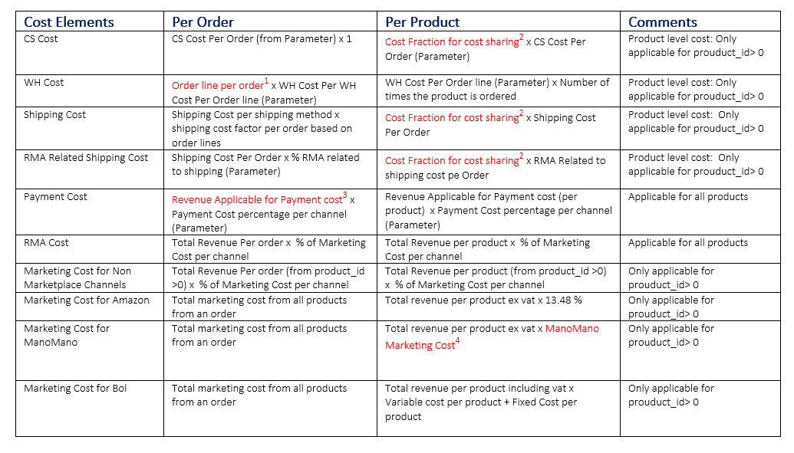
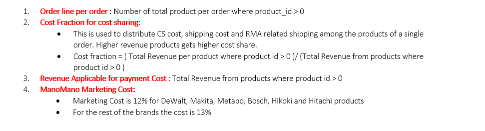

# 1. List of dashboards for purchase

Below is a list of the dashbaord/report that are currently in use by the purchase and category management team. 

#### 1.[Purchase list 1.0](https://dub01.online.tableau.com/#/site/hblonlinesite/views/Purchase_list/product_list?:iid=3) and [total order value per sales class](https://dub01.online.tableau.com/#/site/hblonlinesite/views/Purchase_list/total_order_value?:iid=6) dashboard. 

The sql code used to generate the purchase list can be found [here](https://github.com/jahidrazan/Codes/blob/main/purchase_list.sql). The code is also used in the query editor in tableau. 

**1 - Step 1**: Calculate reorder point factors (RPF): that tells us within the last 28 days, for how many days the product had less than the safety stock. Here, Number of days for Safety Stock = 10 
        
             * RPF =   1 + A/ B 
            
             * A = Summation of the number of days when the stock magento < (Number of days for Safety Stock x avergae sales per day in the last 42 days)
                 
                 = Summation of the number of days when the stock magento < 10 x avergae sales per day in the last 42 days
                 
               
              * B = Time of reference (currently 28 days) 
              
              * RPF can have a range : 1 <= RPF <= 2
              

**2-Step 2**: Count the number of orders per product within the last 90 days
          
**3-Step 3** : Gather Products and product Information 

     * Select products: 
                     1. All products with sales class year: A+, A, B, C, D (Stock magneto < 0)
                     2. Exclude all parent products
     
     * Gather all the information related to products from different tables such as product name, manufacturer, suppliers, 
        product sales in the last 42 days and year, average sales of the product in the last 7 days, 42 days and last year, 
        category, root category, supplier etc. 
     
     * Also, get the Ordered, Confirm, Backorder, Received quantities per product
     
 
 **4-Step 4**: Calculation steps in SQL: 
 
 * REORDER POINT: As we do not have reliable lead time data, the lead time per sales class and supplier is assumed. For details please see the [link](https://hblvof-my.sharepoint.com/:p:/g/personal/jahid_islamrazan_fixami_com/EVH60VtfrUVFhEA7izUUEaoB4aa-uTFFi42QlkCH9RhxaA?e=bLb8Mg)
 *  For the products with minimum desired stock: If the value from calculation (i.e. CORRECTED LEAD TIME x AVG SALES LAST 42 DAYS) is less than the 
                minimum desired stock then take the minimum desired stock. If the calculated qunatity is > minimum desired stock than take the calculated qty

* CORRECTED_LEAD_TIME = REORDER POINT x RPF
 
* PRIMARY QTY

    * CASE 1 - Stock Magento > Reorder Point: Products have sufficient stock and do not need to be ordered and hence

               * PRIMARY_QTY = 0

    * CASE 2 - Stock Magento <= Reorder Point: Products have reached the reorder point (or lower) and required to be ordered.
              
              * PRIMARY QTY = ORDER DAYS x AVG SALES 
              * In CASE 2 : For the products with minimum desired stock if the value from calculation (i.e. ORDER DAYS x AVG SALES) is less than the 
                minimum desired stock then take the minimum desired stock. If the calculated qunatity is > minimum desired stock than take the calculated qty
              
 

* ORDER QTY (In tableau and step 5 the quantity is renamed as ORDER_QTY_CALC to indicate the value is from calculation) 

         
         * CASE 1 : WHEN STOCK MAGENTO > 0 THEN 
                        
                  ORDER QTY = PRIMARY QTY - (ORDERED + CONFIRMED + BACKORDER + RECEIVED) 

         * CASE 2: WHEN STOCK MAGENTO <0 THEN 
                  
                  ORDER QTY = PRIMARY QTY + ABSOLUTE (STOCK MAGENTO) - (ORDERED + CONFIRMED + BACKORDER + RECEIVED) 

 **5-Step 5**: Calculation steps in Tableau: Following Calculation steps have been made in tableau:

* ORDER QTY SEASONAL: The factor is introduced to adjust the seasonality of high (During Nov-Dec) and low season (Jul-Aug):

                 * ORDER QTY SEASONAL = ORDER_QTY_CALC + ORDER_QTY_CALC x SEASONAL CORRECTION FACTOR
                 
                 * SEASONAL CORRECTION FACTOR can be positive (required before the highe season for instance in October) 
                   or negative (required befor low season for instance in June)
                  

* MOQ Unit: Calculate the number of unit requires to be ordered depending on Minimum Order Quantity. When a product can be ordered as a single unit, 
            then the MOQ = 1.
            
                          * MOQ Unit = CEILING (ORDER QTY SEASONAL /MOQ)
                          * Note: Ceiling function convert a value to the next upper limit. 
                          * Example: For a product with ORDER QTY SEASONAL = 20 and MOQ = 12 What is the MOQ Unit? 
                          * MOQ Unit = Ceiling(20/12) 
                                     = Ceiling (1.66)
                                     = 2 
                         
* ORDER QTY =  MOQ Unit x MOQ

                          * Example: For a product with MOQ = 12 and MOQ Unit = 2 What is the ORDER QTY : 
                          * ORDER QTY =  MOQ Unit x MOQ
                                      =  2 x 12
                                      =  24

* ORDER VALUE =  PER UNIT COST x ORDER QTY 

* ACTION: The calculated field can have two possible values:

                        * ORDER: When the following two conditions are met:
                        
                                1. If a product has ORDER QTY >0 
                                2. AND the product does not have a EOL(END OF LIFE)/Disconnected supplier The Order the product
                                
                        * NO ACTION: If a product has ORDER QTY = 0 

#### 2.[Purchase list 2.0](https://dub01.online.tableau.com/#/site/hblonlinesite/views/purcashe_list_2_0/DASHBOARDTOTALORDERVALUE?:iid=1):

* Differences are: Integration of the seasonal products along with the non-seasonal items with minimum desired stock
* Some Key Values are parameterized in the [dashboard](https://dub01.online.tableau.com/#/site/hblonlinesite/views/purcashe_list_2_0/DASHBOARDTOTALORDERVALUE?:iid=1) instead of hardcode.
* Hidden products also have primary qty 
* For [See here details descriptions of the columns ](https://hblvof-my.sharepoint.com/:w:/g/personal/jahid_islamrazan_fixami_com/EfRMhfoCHN1Hr1NxoH9X09kBYE_o4d1UqDm-nCk8dn2Xzw?e=8xpS7S).

#### 3. [Purchase Overview Dashboard](https://dub01.online.tableau.com/#/site/hblonlinesite/views/purchase_overview_dashboard/PurchaseOverview?:iid=1) and [out of stock products](https://dub01.online.tableau.com/#/site/hblonlinesite/views/purchase_overview_dashboard/PurchaseOverview?:iid=1) dashboard. (Documentation Status: Complete)
 

sql code that is used to show the out of stock trends per sales class can be found [here](https://github.com/jahidrazan/Codes/blob/main/Purchase%20Overview%20Dashboard_code_to_calculate_out_of_stock_percentage.sql). 

sql code for calculating stock magento and stock hbs can be found [here](https://github.com/jahidrazan/Codes/blob/main/calculate%20stock%20magento%20and%20stock%20hbs.sql)

sql code for calculating inbound, received, ordered and backorder value can be found [here](https://github.com/jahidrazan/Codes/blob/main/calculate%20inbound%2C%20ordered%20and%20backorder%20value.sql)
    
Please note that- **since we do not purchase the items having an average value lower than a certain threshold ( avg sales in last 42 days <0.05 which is applicable for C and D products consdiering yearly sales class ), the out of stock trend for those products are not shown in the dashboard**.

Following formula is used in tableau to calculate the % of sales class A (the same concept is applicable for other sales class) products out of stock: 

        • If the stock magento of a product is <= 0 then the product is considered out of stock
        • % A product out of stock: Total Number of A products out of stock / Total Number of A products 
        
 To calculate the stock magento value in tableau the following formula has been used :
 
        • Stock Magento Value = Stock Magento Qty (where stock magento >0) x net cost of a product
        
        
#### 4. [Last 3 months trend of stock Development per Sales Class Dashboard](https://dub01.online.tableau.com/#/site/hblonlinesite/views/StockDevlopmentPerSalesClass/StockTrendDashboard?:iid=1) (Documentation Status: Complete)

The sql code for the dashboard can be found [here](https://github.com/jahidrazan/Codes/blob/main/stock_devlopment_per_sales_class.sql).

To see the historical trend of stock, the api_history table is used. FULL_ORDER_HISTORY table is used to show the [revenue comparison trend in the dashboard](https://dub01.online.tableau.com/#/site/hblonlinesite/views/StockDevlopmentPerSalesClass/RevenueandStockDevlopment?:iid=5). 

The dashboard uses all the fields from the query and there is no calculated field made in Tableau.

#### 4. [Weekly Stock Insights Bigquery Dashboard](https://lookerstudio.google.com/reporting/83a55b9f-dcd2-4342-b6c1-863cbc5021f8/page/tNy8B) (Documentation Status: Complete)

This is a data studio dashboard. Primarily used for weekly reporting of data via an excel file. Bram is the owner of the query. For access issue with this dashboard please open a gamil account with your fixami email-id and request access to Bram/Shivdutt.

#### 6. [Stock Health Per Root Category Dashboard](https://dub01.online.tableau.com/#/site/hblonlinesite/views/Product_Stock_Inventory_with_Last28_Days_Sales/DashboardTotalValuePerRCANDSALESCLASS?:iid=1)

#### 7. [Shipping time per sales class](https://dub01.online.tableau.com/#/site/hblonlinesite/workbooks/1059466/views).  (Documentation Status: Complete)

The sql code can be found [here](https://github.com/jahidrazan/Codes/blob/main/shipping_time_and_revenue_per_sales_class.sql).

Following formula is used in tableau to calculate the % of A products shipped within 0-1 days: 

        • % A products shipped in 0-1 days: Total Number of A products shipped within 0-1 day / Total Number of A products sold

Similar logic is also applicable for calculting the % of products shipped in 0-1 days for sales class A+, B, C,and D. Also, the same method is used for calculating the percentage of shipped products within 0-1 days. 

To calculate the total number of orders shipped in 0-1 day the following logic is used in tableau: 

       • % of orders shipped in 0-1 day : Total orders shipped within 0-1 day / Total Number of orders

#### 8. [CM Calcuation](https://dub01.online.tableau.com/#/site/hblonlinesite/views/CM_Calculation_including_Amazon/Cost_Dashboard?:iid=1) Dashboard. 

The sql code can be found [here](https://github.com/jahidrazan/Codes/blob/main/CM_calculation.sql). The sql code used in the query editor in tableau. 
  
Following definitions are important to understand the CM concept:

  * Total Cost = CS Cost + Marketing Cost + Payment Cost + WH Cost + RMA Cost + RMA related Shipping Cost
  
  * CM per Order = Margin Total Net -  Total Cost
  
  
  
  
  
  
  The definition of order line details used for shipping cost factors:
  
  Without the product_id <0: 
  
  * If an order has 1 product id, and a single quantity is sold then it is a 'Single-line' order
  * If an order has 1 product id, and more than a single quantity is sold then it is a 'Single-line plus' order
  * If an order has more than 1 product id and more than a single quantity is sold then it is a 'Multi-line' order
  
  Shipping cost factors based on order lines are listed below:  
   
  

# 2. Conceptual ERD
The Conceptual ERD is a good starting point to understand the relationship between products table and other associated information related to products:

 

  • Revenue and product tables are connected via product id. Product information missing in the revenue tables (such as product classification) can be added by joining the revenue tables with the products table. The easiest way to obtain the missing product information is often  by joining tables through the product tables via the key- which is product_id

  • All the business questions related to revenue, order, shipping method, and contribution margin can be answered based on the 3 tables. 
 
  • FULL HISTORY table contains all the sales history since 2018 and updated daily (3 am in the morning).
  
  • LM table keeps the data of the last month and updated hourly.
    
  • LTM table keeps the data of the last 12 months and updated daily (3 am in the morning).
  
   

# 3. DATA MODELS

Most problems related to product stock (and the purchase department) can be solved by joining the api tables.  

 
  

 Also, some temporary tables has been created to solve the questions related to minimum order quantity, minimum desired quantity, super sales items and automatisch uitschakelen products.Please note that, these tables have been created using data from google sheet. A table created from the google sheet cannot be directly imported to tableau and therefore, a query has been made to see the output of the first table and the result has been saved as another bigquery table, with a name: _for_purchase and imported in the tableau analysis.
 
 

# 4. Other codes used to estimate purchase qty

1. Festool Purchase qty for 160 days: change the number of days as appropriate follwoing the comment in the code. [Code link](https://github.com/jahidrazan/Codes/blob/main/Expected_sales_Festool.sql). The code can be adapted for other brands as well changing the Brand name.

2. Lamp purchase for 2022. [Code link](https://github.com/jahidrazan/Codes/blob/main/Expected_sales_lamps_2022.sql)

3. Bladblazer Sales for 2022 [Code Link](https://github.com/jahidrazan/Codes/blob/main/Expected_sales_Bladblazer_2022.sql)

4. Code for legal team to report total sales value for NL [Code link](https://github.com/jahidrazan/Codes/blob/main/Query_purchase_value_per_Cat_NL_2022_for_legal_team.sql)

5. Code for legal team to report child qty shipped in FR and NL [Code link](https://github.com/jahidrazan/Codes/blob/main/Query_for_legal_team_for_shipped_child_qty_FR_NL_2022.sql)

# 5. Excel Files Used in to create temporary tables:

1. [Minimum Desired Qty for purchase list 2.0 ](https://docs.google.com/spreadsheets/d/1hCO-6F9hUbj7lqVRCmU9lKYsu6uvOSoINO2O7A7XTE0/edit?usp=sharing)
   Columns are (From left to right): 1. Product id
                                     2. minimum desired qty
                                     3. Start Date: When does the purchase beings
                                     4. End date: : When does the purchase ends
                                     5. Product Description: Seasonal or not (RIck owns the seasonal products while Ricardo owns the non-seasonal products)
                                     
3. [Minimum Desired Qty for purchase list 1.0 ](https://docs.google.com/spreadsheets/d/1tH55-qQ31fAhl8QVSLemnltydckm99Aadj7Zi3KHIiw/edit?usp=sharing)
 Columns are (From left to right):   1. Product id
                                     2. minimum desired qty

6. [Minimum Order Qty to Calculate MOQ](https://docs.google.com/spreadsheets/d/1aGMu-5H-ZdrKKCzJehSCvkLsJPhPZ2PR-mL4TVIwsL0/edit?usp=sharing)

 Columns are (From left to right):   1. Product id
                                     2. minimum order qty

8. [Bol Products Marketing Cost commission](https://docs.google.com/spreadsheets/d/1yI5Ef8KOCwClKjthKnYgzHoY-lnuKtF4WMkuS6VdYvw/edit#gid=0)
Columns are (From left to right): 1. Product id 
                                  2. Commission % (5.8% has been made 0.058 after dividing it by 100)
                                  
10.  Automatisch Uitschkelen items & Super Sales: will not be added since as these items changes frequnctly and can be obtained from CATMATN.

# 6. Summary of Purchase Process & ERD

1. [Introduction to Purchase- Part 1 of Video](https://hblvof-my.sharepoint.com/:v:/g/personal/jahid_islamrazan_fixami_com/EZjph121aDRBrD6pDQ9_kxkBQuy8hTnD1TXIvmuoI_Ms-w?e=dj3ECo), [PPT Link](https://hblvof-my.sharepoint.com/:p:/g/personal/jahid_islamrazan_fixami_com/ES2GRALKJ99BouBgLvL8tOYBW3KHcMtm33ZC97xZE8eJvw?e=4htlxX)
2. [Introduction to Purchase-Part 2 of Video](https://hblvof-my.sharepoint.com/:v:/g/personal/jahid_islamrazan_fixami_com/Ea2bKQW8hTpInIflVgq8_jUBNaowyQr8KO7fJX1um2bVvQ?e=293LRr), [PPT Link](https://hblvof-my.sharepoint.com/:p:/g/personal/jahid_islamrazan_fixami_com/EVH60VtfrUVFhEA7izUUEaoB4aa-uTFFi42QlkCH9RhxaA?e=bLb8Mg)
3. [Introduction to ERD Video Link](https://hblvof-my.sharepoint.com/:v:/g/personal/jahid_islamrazan_fixami_com/EVGWmrYWpAxOsXqe7Udu9HYBgrp0LtgeuQMwByqwimlB1A?e=ccRN9i), [PPT LINK](https://hblvof-my.sharepoint.com/:p:/g/personal/jahid_islamrazan_fixami_com/ET69HHLvb59Pm1Uz3e9Ze9wBdIt_CY9zXKMjtRSDLwC7MQ?e=HPjkh9)
