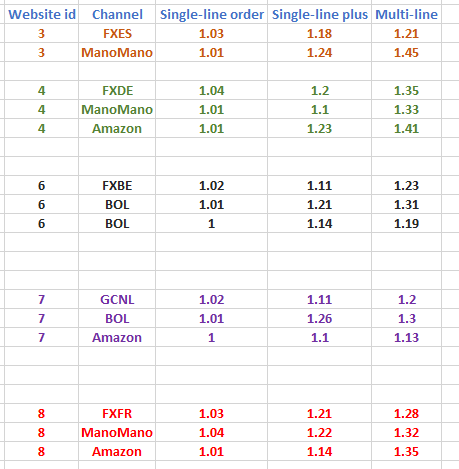
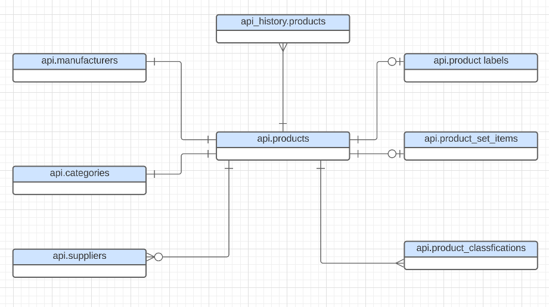
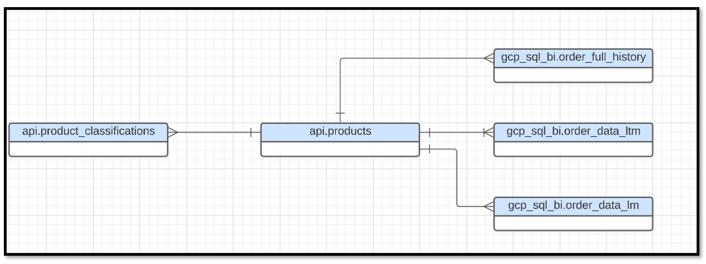
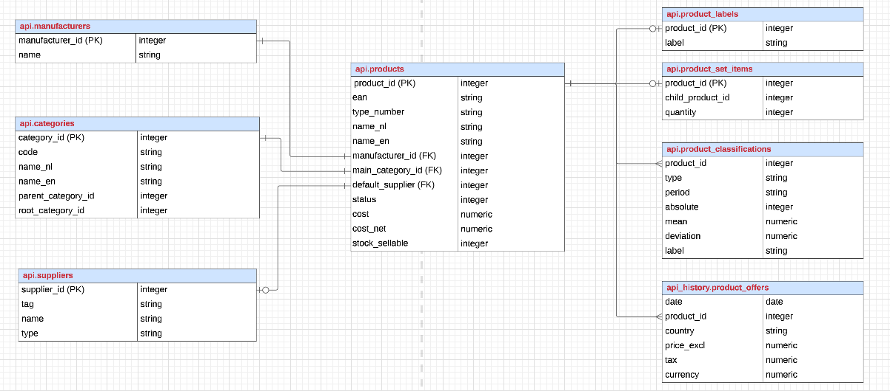
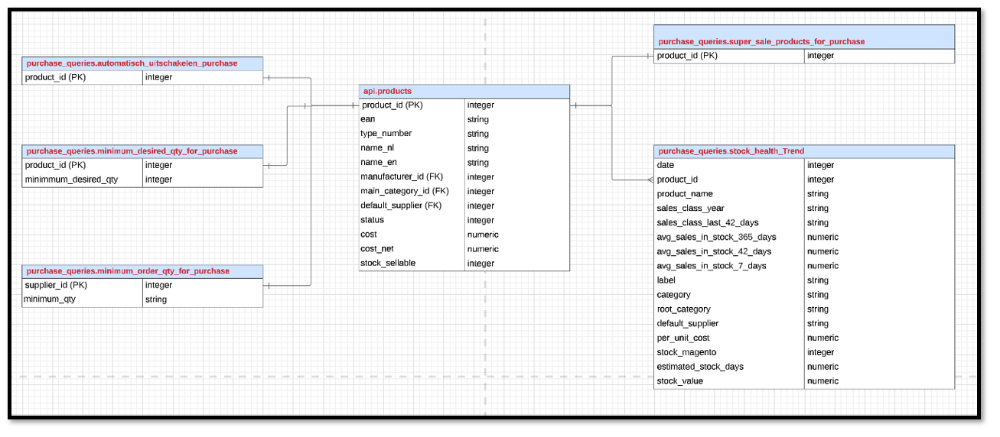

# 1. List of dashboards for purchase

Below is a list of the dashbaord/report that are currently in use by the purchase and category management team. 

#### 1. [Purchase list](https://dub01.online.tableau.com/#/site/hblonlinesite/views/Purchase_list/product_list?:iid=3) and [total order value per sales class](https://dub01.online.tableau.com/#/site/hblonlinesite/views/Purchase_list/product_list?:iid=2) dashboard. 

The sql code used to generate the purchase list can be found [here](https://github.com/jahidrazan/Codes/blob/main/purchase_list.sql). The code is also used in the query editor in tableau. 

#### 2. [Purchase Overview Dashboard](https://dub01.online.tableau.com/#/site/hblonlinesite/views/purchase_overview_dashboard/PurchaseOverview?:iid=1) and [out of stock products](https://dub01.online.tableau.com/#/site/hblonlinesite/views/purchase_overview_dashboard/PurchaseOverview?:iid=1) dashboard. (Documentation Status: Complete)
 

sql code that is used to show the out of stock trends per sales class can be found [here](https://github.com/jahidrazan/Codes/blob/main/Purchase%20Overview%20Dashboard_code_to_calculate_out_of_stock_percentage.sql). 

sql code for calculating stock magento and stock hbs can be found [here](https://github.com/jahidrazan/Codes/blob/main/calculate%20stock%20magento%20and%20stock%20hbs.sql)

sql code for calculating inbound, received, ordered and backorder value can be found [here](https://github.com/jahidrazan/Codes/blob/main/calculate%20inbound%2C%20ordered%20and%20backorder%20value.sql)
    
Please note that- **since we do not purchase the items having an average value lower than a certain threshold ( avg sales in last 42 days <0.05 which is applicable for C and D products consdiering yearly sales class ), the out of stock trend for those products are not shown in the dashboard**.

Following formula is used in tableau to calculate the % of sales class A (the same concept is applicable for other sales class) products out of stock: 

        • If the stock magento of a product is <= 0 then the product is considered out of stock
        • % A product out of stock: Total Number of A products out of stock / Total Number of A products 
        
 To calculate the stock magento value in tableau the following formula has been used :
 
        • Stock Magento Value = Stock Magento Qty (where stock magento >0) x net cost of a product
        
        
#### 3. [Last 3 months trend of stock Development per Sales Class Dashboard](https://dub01.online.tableau.com/#/site/hblonlinesite/views/StockDevlopmentPerSalesClass/StockTrendDashboard?:iid=1) (Documentation Status: Complete)

The sql code for the dashboard can be found [here](https://github.com/jahidrazan/Codes/blob/main/stock_devlopment_per_sales_class.sql).

To see the historical trend of stock, the api_history table is used. FULL_ORDER_HISTORY table is used to show the [revenue comparison trend in the dashboard](https://dub01.online.tableau.com/#/site/hblonlinesite/views/StockDevlopmentPerSalesClass/RevenueandStockDevlopment?:iid=5). 

The dashboard uses all the fields from the query and there is no calculated field made in Tableau.

#### 4. [Weekly Stock Insights Bigquery Dashboard](https://lookerstudio.google.com/reporting/83a55b9f-dcd2-4342-b6c1-863cbc5021f8/page/tNy8B) (Documentation Status: Complete)

This is a data studio dashboard. Primarily used for weekly reporting of data via an excel file. Bram is the owner of the query. For access issue with this dashboard please open a gamil account with your fixami email-id and request access to Bram/Shivdutt.

#### 5. [Stock Health Per Root Category Dashboard](https://dub01.online.tableau.com/#/site/hblonlinesite/views/Product_Stock_Inventory_with_Last28_Days_Sales/DashboardTotalValuePerRCANDSALESCLASS?:iid=1)

#### 6. [Shipping time per sales class](https://dub01.online.tableau.com/#/site/hblonlinesite/workbooks/1059466/views).  (Documentation Status: Complete)

The sql code can be found [here](https://github.com/jahidrazan/Codes/blob/main/shipping_time_and_revenue_per_sales_class.sql).

Following formula is used in tableau to calculate the % of A products shipped within 0-1 days: 

        • % A products shipped in 0-1 days: Total Number of A products shipped within 0-1 day / Total Number of A products sold

Similar logic is also applicable for calculting the % of products shipped in 0-1 days for sales class A+, B, C,and D. Also, the same method is used for calculating the percentage of shipped products within 0-1 days. 

To calculate the total number of orders shipped in 0-1 day the following logic is used in tableau: 

       • % of orders shipped in 0-1 day : Total orders shipped within 0-1 day / Total Number of orders

#### 7. [Overstock List](https://dub01.online.tableau.com/#/site/hblonlinesite/views/Overstockproductlistallproducts/OVERSTOCK_LIST?:iid=2)

#### 8. [CM Calcuation](https://dub01.online.tableau.com/#/site/hblonlinesite/views/CM_Calculation_including_Amazon/Cost_Dashboard?:iid=1) Dashboard. 

The sql code can be found [here](https://github.com/jahidrazan/Codes/blob/main/CM_calculation.sql). The sql code used in the query editor in tableau. 
  

  * Marketing Cost ( applicable only for Product_Id >0):  
    
     
     * Marketing Cost for webchannel orders =  Marketing cost percentage for a channel (from tableau parameter) * line_total_ex_vat 
     
     * For bol products a specific percentage is assigned per product. The data per product is available on the following table: *hbl-online.purchase_queries.Jahid_bol_commission*
     
     * For ManoMano products from DeWALT, Makita, Metabo, Bosch, HiKOKI, and Hitachi have 12% of the line_total_ex_vat. The rest of the brands have 13% of the line_total_ex_vat
     
     * Amazon has a marketing cost of 13.48% of the line_total_ex_vat
      
  * Payment Cost: a percentage of revenue is assigned per channel through tableau parameter, no payment cost is applicable for marketplaces
  
      * Payment Cost =  Revenue Applicable For Payment Cost from the web channel x line_total_ex_vat 
      
      * Revenue Applicable For Payment Cost: Revenue Ex Vat >0 condition must be met
  
  * WH Cost
    
    * WH cost per order =  WH_cost_ per_orderline (through tableau parameter) x Order Line
    * Orderline : Sum of non zero product ids per order id
  
  * RMA Cost:
     * RMA Cost Per Order = Line total Ex Vat x % RMA Cost Per Channel (from tableau parameter)
  
  * Shipping Cost: assigned per country, per shipping method, per orderline (hardcoded in the tableau order level shipping cost per order filed) 

  The details of the shipping cost per channel per method can be found on [table t4 in the sql code](https://github.com/jahidrazan/Codes/blob/main/CM_calculation.sql)
  
  For non pallets shipping the shipping cost depends on the order line. Orderline to calculate the shipping cost is defined in tableau calculated field (name of the field: Single_Or_Multi_Line) 
  
  The definition is based on the following logic: Without considering the negative product ids:
  
  * If an order has 1 product id and a single quantity is sold then it is a Single line order
  * If an order has 1 product id and more than a single quantity is sold then it is a Single line order
  * If an order has more than 1 product id and more than a single quantity is sold then it is a Multi line order
  
  Depending on the 
   
  
  
  * RMA related Shipping Cost: 
        * RMA related Shipping Cost = Shipping Cost x % RMA Impact on Shipping Cost (from tableau parameter)
        
  * Total Cost = CS Cost + Marketing Cost + Payment Cost + WH Cost + RMA Cost + RMA related Shipping Cost
  
  * CM per Order = Margin Total Net -  Total Cost
  
# 2. Conceptual ERD
The Conceptual ERD is a good starting point to understand the relationship between products table and other associated information related to products:

 

  • Revenue and product tables are connected via product id. Product information missing in the revenue tables (such as product classification) can be added by joining the revenue tables with the products table. The easiest way to obtain the missing product information is often  by joining tables through the product tables via the key- which is product_id

  • All the business questions related to revenue, order, shipping method, and contribution margin can be answered based on the 3 tables. 
 
  • FULL HISTORY table contains all the sales history since 2018 and updated daily (3 am in the morning).
  
  • LM table keeps the data of the last month and updated hourly.
    
  • LTM table keeps the data of the last 12 months and updated daily (3 am in the morning).
  
   

# 2. DATA MODELS

Most problems related to product stock (and the purchase department) can be solved by joining the api tables.  

 
  

 Also, some temporary tables has been created to solve the questions related to minimum order quantity, minimum desired quantity, super sales items and automatisch uitschakelen products.Please note that, these tables have been created using data from google sheet. A table created from the google sheet cannot be directly imported to tableau and therefore, a query has been made to see the output of the first table and the result has been saved as another bigquery table, with a name: _for_purchase and imported in the tableau analysis.
 
 

# 3. Summary of Purchase Process & ERD

1. [Introduction to Purchase- Part 1 of Video](https://hblvof-my.sharepoint.com/:v:/g/personal/jahid_islamrazan_fixami_com/EZjph121aDRBrD6pDQ9_kxkBQuy8hTnD1TXIvmuoI_Ms-w?e=dj3ECo), [PPT Link](https://hblvof-my.sharepoint.com/:p:/g/personal/jahid_islamrazan_fixami_com/ES2GRALKJ99BouBgLvL8tOYBW3KHcMtm33ZC97xZE8eJvw?e=4htlxX)
2. [Introduction to Purchase-Part 2 of Video](https://hblvof-my.sharepoint.com/:v:/g/personal/jahid_islamrazan_fixami_com/Ea2bKQW8hTpInIflVgq8_jUBNaowyQr8KO7fJX1um2bVvQ?e=293LRr), [PPT Link](https://hblvof-my.sharepoint.com/:p:/g/personal/jahid_islamrazan_fixami_com/EVH60VtfrUVFhEA7izUUEaoB4aa-uTFFi42QlkCH9RhxaA?e=bLb8Mg)
3. [Introduction to ERD Video Link](https://hblvof-my.sharepoint.com/:v:/g/personal/jahid_islamrazan_fixami_com/EVGWmrYWpAxOsXqe7Udu9HYBgrp0LtgeuQMwByqwimlB1A?e=ccRN9i), [PPT LINK](https://hblvof-my.sharepoint.com/:p:/g/personal/jahid_islamrazan_fixami_com/ET69HHLvb59Pm1Uz3e9Ze9wBdIt_CY9zXKMjtRSDLwC7MQ?e=HPjkh9)
